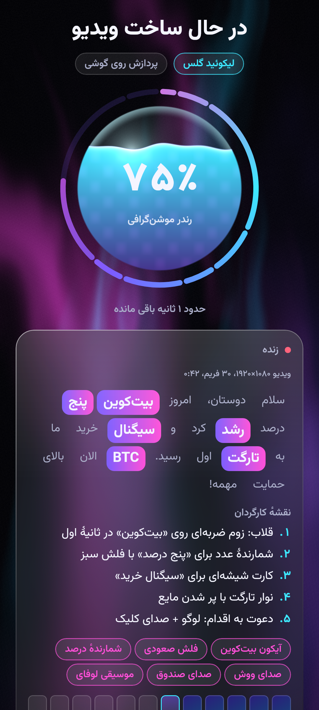
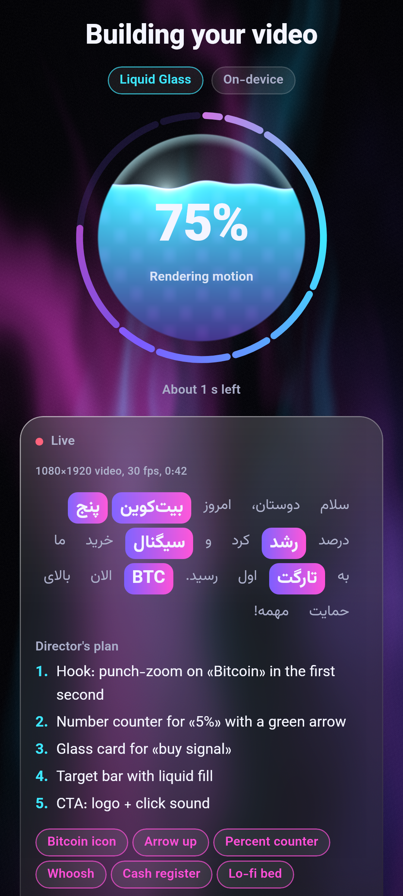

# Trimio

Automatic motion-graphics & editing studio for Android (iOS and Web planned).
Input: a video **or audio only** plus a prompt. Output: a professionally edited video with word-level
Persian/English captions, elements, sound design and motion graphics in 28 design styles —
running on-device, with an optional bring-your-own-key cloud LLM.

- Architecture: [`docs/ARCHITECTURE.md`](docs/ARCHITECTURE.md)
- Roadmap: [`docs/ROADMAP.md`](docs/ROADMAP.md)

## Build screen

Rendered off-screen by the screenshot tests (real Skia, phone size):

| فارسی | English |
|---|---|
|  |  |

## Stack

Kotlin Multiplatform · Compose Multiplatform · Media3 · whisper.cpp · llama.cpp · Skia / Filament

## Modules

| Module | Purpose |
|---|---|
| `androidApp` | Android entry point (Android 13+, API 33) |
| `shared` | App root UI, DI and navigation shared by all platforms |
| `feature/*` | Screens |
| `core/model` | Timeline DSL, transcript, styles, inputs |
| `core/pipeline` | Job orchestration and weighted progress |
| `core/designsystem` | Trimio design system |
| `engine/media` | Media probing and audio decoding (MediaExtractor/MediaCodec on Android, WAV on desktop) |
| `engine/audio` | Resampling, EBU R128 loudness, VAD, pitch and word emphasis; real pipeline stages |

## Build

Requires JDK 21 and the Android SDK (compileSdk 37).

```bash
./gradlew :androidApp:assemblePlayDebug   # Android (Google Play flavor)
./gradlew :androidApp:assembleBazaarDebug # Android (Cafe Bazaar flavor)
./gradlew jvmTest                         # unit, shader and screenshot tests
```

Screenshot tests write PNGs to `feature/*/build/screenshots`, shader tests to `core/designsystem/build/shader-previews`.
