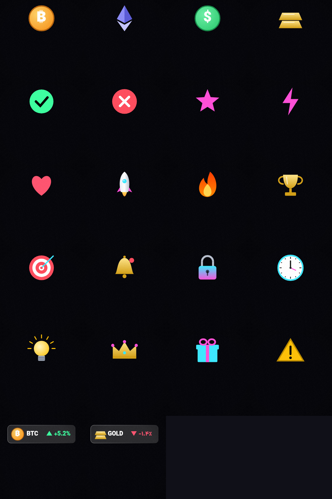

# المان‌ها، صدا و موسیقی

همهٔ Assetهای Trimio **با کد ساخته می‌شوند** (Procedural): هیچ فایل صوتی یا تصویری دانلود یا لایسنس نمی‌شود، خروجی کاربر بدون محدودیت حق نشر است و نتیجه روی همهٔ پلتفرم‌ها یکسان است.

## المان‌های تصویری (`ElementClip.assetId`)

| شناسه | توضیح | پارامترها |
|---|---|---|
| `counter/…` | عدد شمارنده (ارقام فارسی برای محتوای فارسی) | `from`, `to`, `decimals`, `prefix`, `suffix`, `digits=fa`, `label` |
| `ticker/<symbol>` | کارت بازار: آیکون، نماد، درصد تغییر سبز/قرمز | `symbol`, `change`, `digits=fa` |
| `chart/candles` | نمودار شمعی با روند | `trend=up|down`, `seed` |
| `arrow/up` · `arrow/down` | فلش سود/ضرر | — |
| `badge/…` | برچسب متنی | `text` |
| `progress/…` | نوار پیشرفت | `value` (۰ تا ۱) |
| `icon/<id>` | ۲۰ آیکون برداری (`core/model/asset/IconCatalog.kt`) | — |

آیکون‌ها: coin، eth، dollar، gold، check، cross، star، bolt، heart، rocket، fire، trophy، target، bell، lock، clock، bulb، crown، gift، warning — هر کدام با کلیدواژه‌های فارسی و انگلیسی برای انتخاب خودکار.

## افکت‌های صوتی (`sfx/<id>`)

pop · click · tick · whoosh · whoosh-soft · swoosh · impact · shimmer · riser · ding · cash · glitch

سنتز با اسیلاتور ضد-aliasing (polyBLEP)، فیلتر SVF، نویز صورتی و ریورب؛ پیک ‎-1 dBFS، بدون کلیک در انتها.

## موسیقی (`music/<mood>`)

| حس | BPM | سازبندی |
|---|---|---|
| uplifting | 118 | کیک چهارضرب، آرپژ، پد، باس هشتم |
| energetic | 126 | هت شانزدهم، باس آف‌بیت، آرپژ |
| chill | 84 | کیبورد الکتریک، وینیل، باس نرم |
| cinematic | 92 | پد، تام، ریورب بزرگ |
| corporate | 108 | کیبورد، آرپژ، کلپ |
| tense | 100 | باس پالسی، پد، تام |

هر بستر ۸ میزان است و بی‌درز لوپ می‌شود؛ میکسر زیر صدای گوینده آن را پایین می‌آورد (Ducking) و در پایان محو می‌کند.

## همگام‌سازی با ضرب

`AssetMatchingStage` شبکهٔ ضرب موسیقی را می‌سازد و ورود المان‌ها (و افکت ورودشان) را اگر ضربی در ±۱۲۰ میلی‌ثانیه باشد روی ضرب می‌برد؛ هیچ‌وقت دو المان روی هم نمی‌افتند.

## تطبیق معنایی

`SemanticIndex` بردار n-gram حرفی (۲ تا ۴) از متن نرمال‌شده می‌سازد: «موشکی»، «rockets» و «آتیش» به آیکون درست می‌رسند، بدون دانلود مدل. جایگزینی با Embedding عصبی بدون تغییر رابط ممکن است (فاز ۹).
