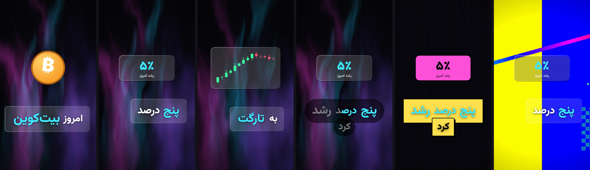
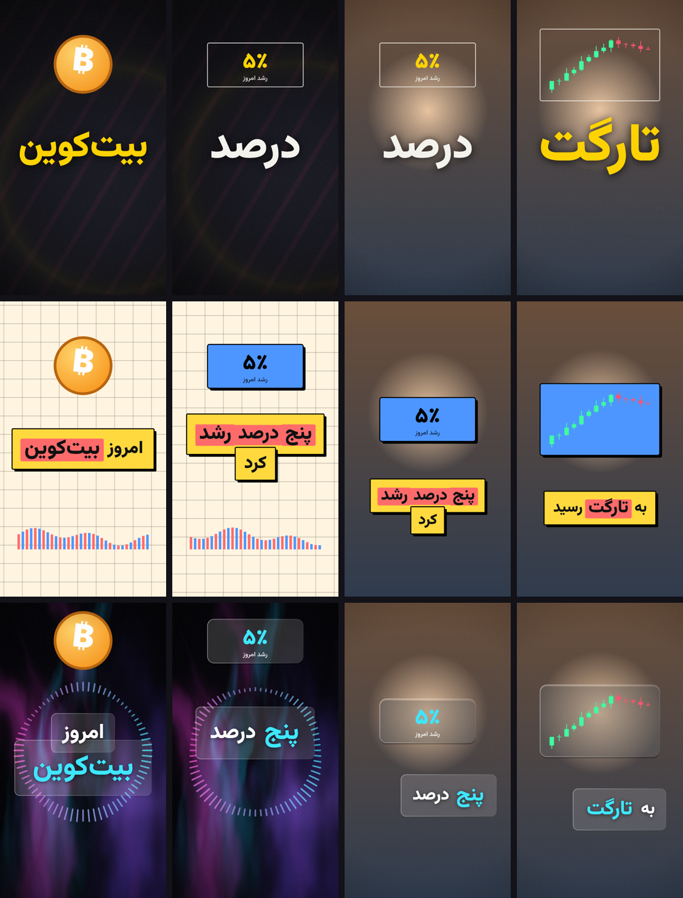
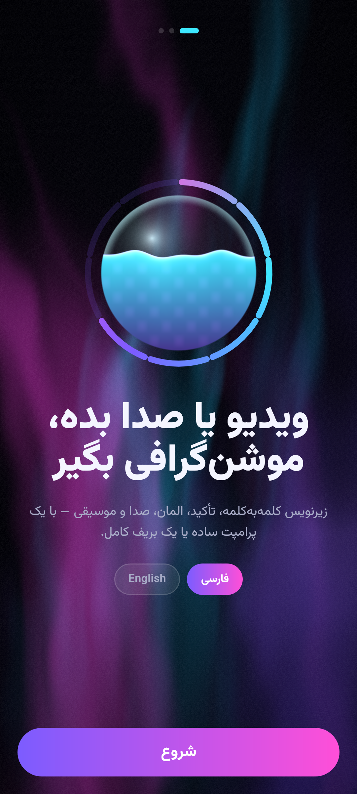
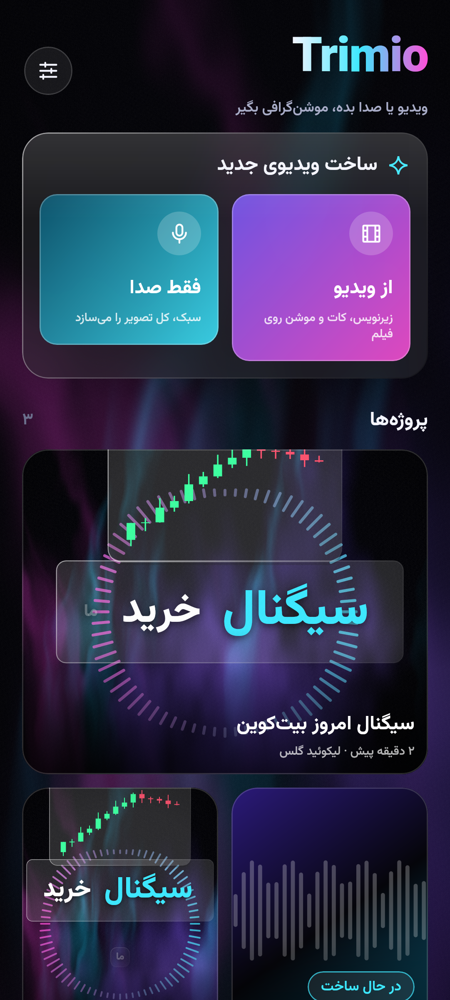
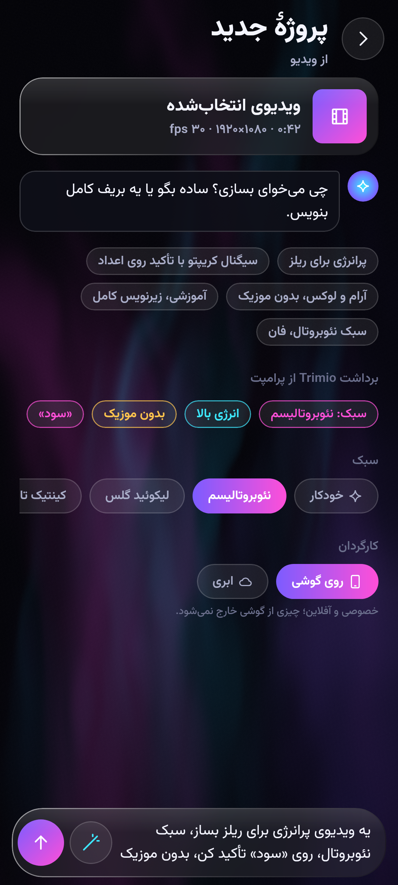
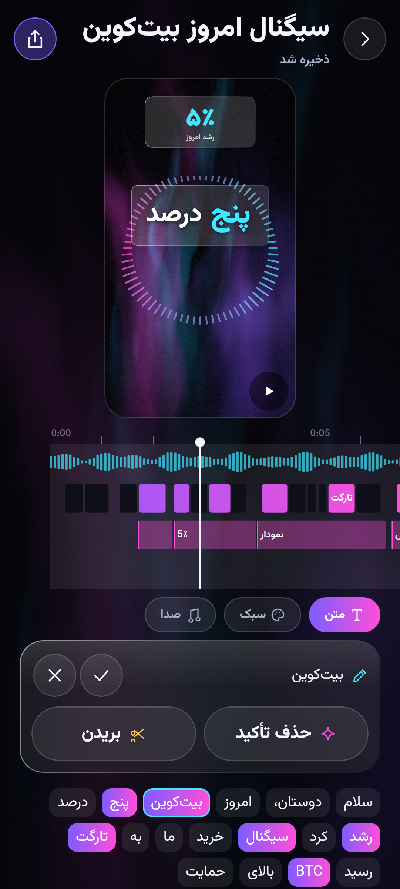
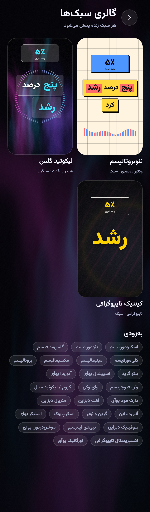
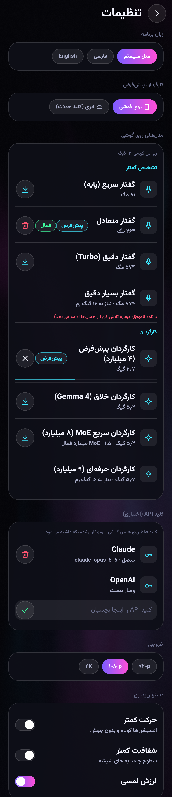
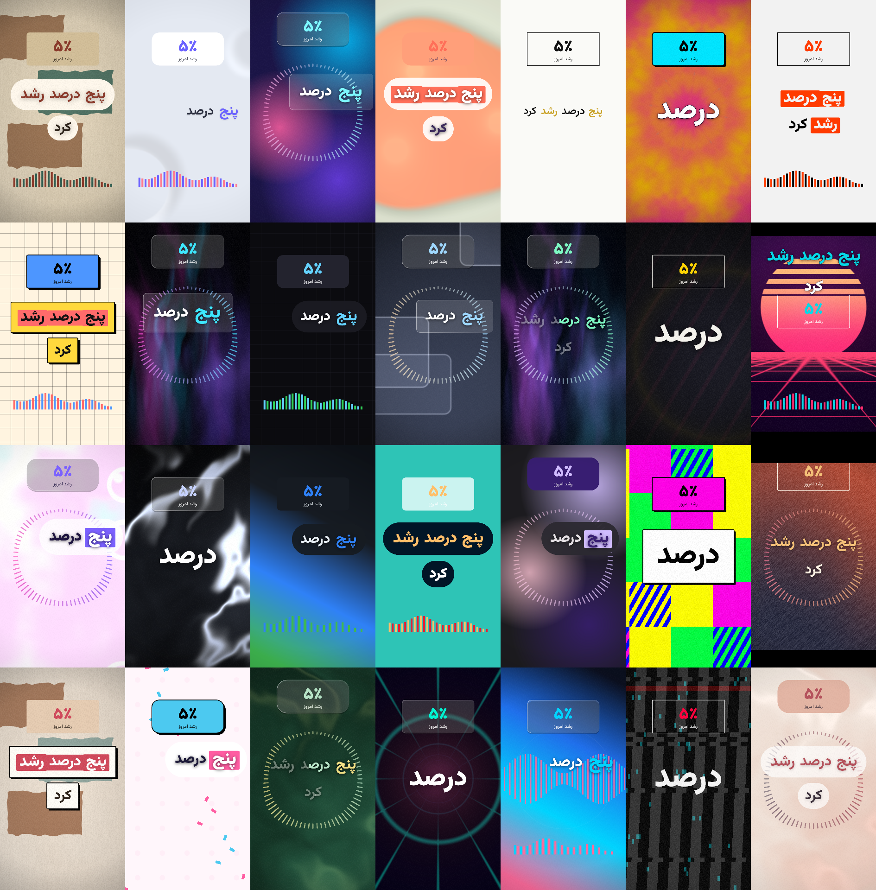

# نقشهٔ راه Trimio

> **راهنما:** `[x]` انجام‌شده · `[ ]` باقی‌مانده · 🔄 فاز در حال انجام
> هر فاز «معیار پذیرش» دارد. تا همهٔ معیارهای یک فاز پاس نشده‌اند، فاز بسته نمی‌شود.
> معماری مرجع: [`ARCHITECTURE.md`](ARCHITECTURE.md)

## خلاصهٔ وضعیت

| فاز | عنوان | وضعیت |
|---|---|---|
| ۰ | پایه و زیرساخت | ✅ |
| ۱ | موتور مدیا و صدا | ✅ |
| ۲ | تشخیص گفتار و رونوشت | ✅ |
| ۳ | موتور رندر و خروجی | ✅ |
| ۴ | پکیج سبک و سه سبک اول | ✅ |
| ۵ | کارگردان (Director) و هوش مصنوعی | ✅ |
| ۶ | المان‌ها، افکت صوتی و موسیقی | ✅ |
| ۷ | اپ کامل (صفحه‌ها و جریان کاربر) | ✅ |
| ۸ | ۲۸ سبک کامل | ✅ |
| ۹ | کیفیت سطح Enterprise | 🔄 |
| ۱۰ | سرور، پرداخت و انتشار | ⬜ |
| ۱۱ | iOS و وب | ⬜ |

## تعریف «انجام‌شده» (برای هر آیتم)

- [x] کد در ماژول درست و پشت رابط مشترک (`core/*` بدون وابستگی پلتفرمی)
- [x] تست واحد در `commonTest`؛ برای UI تست اسکرین‌شات؛ برای شیدر تست کامپایل Skia
- [x] بیلد هر دو flavor اندروید + کامپایل وب در CI سبز
- [x] کامیت جدا با پیام توضیحی و پوش

---

## فاز ۰ — پایه و زیرساخت ✅

### ساختار پروژه
- [x] Kotlin Multiplatform با تارگت‌های Android، JVM (تست و ابزار دسکتاپ)، iOS، Wasm
- [x] Convention plugins در `build-logic` (`trimio.kmp.library`، `trimio.kmp.compose`)
- [x] Version catalog با آخرین نسخه‌های پایدار (AGP 9.4، Kotlin 2.4، Compose MP 1.12، compileSdk 37)
- [x] حداقل اندروید ۱۳ (API 33)
- [x] دو flavor فروشگاه: `play` و `bazaar`
- [x] source set مشترک `skiko` برای iOS/دسکتاپ/وب
- [x] CI در GitHub Actions: تست‌ها، کامپایل وب، بیلد دو flavor
- [x] مستندات: معماری، نقشهٔ راه، README

### `core/model`
- [x] `Timeline` نسخه‌دار + کلیپ‌ها: caption، element، sfx، music، background، cut
- [x] کدک JSON سازگار با نسخه‌های آینده (`ignoreUnknownKeys`، رد نسخهٔ جدیدتر)
- [x] `TimelineValidator`: محدوده، هم‌پوشانی زیرنویس، خوانایی، گین، پس‌زمینهٔ کامل برای حالت فقط-صدا
- [x] ورودی `Video` و `AudioOnly` + `CanvasSpec` (نسبت تصویر، رزولوشن، فریم‌ریت)
- [x] `Transcript` و `Word`: تقسیم به خط زیرنویس، تشخیص سکوت
- [x] تشخیص خط فارسی/انگلیسی برای هر کلمه، تبدیل ارقام فارسی/لاتین
- [x] کاتالوگ ۲۸ سبک در ۶ خانوادهٔ رندر

### `core/pipeline`
- [x] ۹ مرحله با وزن (جمع ۱۰۰)
- [x] `PipelineOrchestrator`: پیشرفت وزن‌دار، ETA، وضعیت هر مرحله، سیگنال‌های زنده
- [x] چک‌پوینت و ادامهٔ کار پس از قطع شدن
- [x] Artifacts تایپ‌شده بین مراحل
- [x] `DemoPipeline` برای توسعهٔ UI

### `core/designsystem`
- [x] توکن‌های رنگ (تیره سینمایی + روشن)، حرکت فنری، فاصله، گوشه
- [x] فونت متغیر Vazirmatn (فارسی + لاتین)، ارقام هم‌عرض
- [x] تم ریشه با زبان و جهت راست‌به‌چپ
- [x] `TrimioShader`: یک کد شیدر برای AGSL (اندروید) و SkSL (بقیه)، با fallback
- [x] شیدر Aurora (واکنش به انرژی صدا) و گوی مایع
- [x] کامپوننت‌ها: LiquidProgressOrb، GlassPanel، WordStream، WaveformStrip، FilmStrip، StepRail، GlassChip
- [x] تست کامپایل و رندر شیدرها با Skia واقعی

### `feature/stream` و اپ
- [x] صفحهٔ استریم ساخت ۰ تا ۱۰۰٪ + Reducer خالص
- [x] جهت متن گفتار مستقل از زبان رابط
- [x] تست اسکرین‌شات فارسی و انگلیسی
- [x] `shared`: ریشهٔ اپ + Koin
- [x] `androidApp`: edge-to-edge، زبان مستقل اپ، آیکون تطبیقی و Themed، الزام Vulkan

---

## فاز ۱ — موتور مدیا و صدا ✅

### داده‌ها (`core/model`)
- [x] `PcmAudio`: صدای مونو float با نرخ نمونه
- [x] `AudioFeatures`: مسیر انرژی و Pitch فریم‌به‌فریم (برای کارگردان و پس‌زمینهٔ واکنشی)

### `engine/audio` (Kotlin مشترک، روی همهٔ پلتفرم‌ها)
- [x] Resampler با فیلتر sinc پنجره‌دار (ورودی دلخواه ← ۱۶ کیلوهرتز برای Whisper)
- [x] اندازه‌گیری بلندی صدا طبق ITU-R BS.1770-4 / EBU R128 (K-weighting + gating)
- [x] نرمال‌سازی به هدف شبکه‌های اجتماعی (‎−14 LUFS) با سقف پیک
- [x] تشخیص گفتار/سکوت (VAD) با کف نویز تطبیقی، hangover و ادغام فاصله‌ها
- [x] تحلیل Prosody: انرژی + Pitch (الگوریتم YIN)
- [x] امتیاز تأکید هر کلمه (انرژی، Pitch و کشش نسبت به خط پایهٔ گوینده)
- [x] نمودار موج برای UI
- [x] کدک WAV (PCM16) برای تست، دسکتاپ و ورودی Whisper

### `engine/media`
- [x] رابط‌های `MediaProbe` و `AudioDecoder`
- [x] اندروید: Probe با MediaExtractor (ابعاد، چرخش، فریم‌ریت، HDR، مدت) — کامپایل‌شده، تست روی گوشی در فاز ۹
- [x] اندروید: دیکود صدا با MediaCodec ← PCM مونو، با گزارش پیشرفت — کامپایل‌شده، تست روی گوشی در فاز ۹
- [x] JVM: پیاده‌سازی مبتنی بر WAV برای تست و ابزار دسکتاپ

### مراحل واقعی پایپ‌لاین
- [x] `IngestStage`
- [x] `AudioCleanupStage` (دیکود، نرمال‌سازی، VAD، سیگنال موج زنده)
- [x] `AnalysisStage` (تأکید کلمات + ویژگی‌های صدا)
- [x] تست یکپارچه: WAV ساختگی ← Orchestrator ← خروجی درست

**نتیجهٔ معیار پذیرش (پاس شد):** بلندی موج مرجع با خطای کمتر از ۰٫۲ LU در ۴۸/۴۴٫۱/۱۶ کیلوهرتز ✓ · مرزهای VAD با خطای کمتر از ۵۰ms ✓ · کلمهٔ تأکیدی بالاترین امتیاز ✓ · ۱۰ دقیقه صدا در ۳٫۲ ثانیه روی JVM ✓

**معیار پذیرش:** بلندی موج سینوسی مرجع با خطای کمتر از ۰٫۲ LU؛ VAD بازه‌های گفتار ساختگی را با خطای کمتر از ۵۰ms پیدا کند؛ کلمهٔ بلندتر/زیرتر بیشترین امتیاز تأکید را بگیرد؛ تحلیل ۱۰ دقیقه صدا روی JVM زیر ۵ ثانیه.

---

## فاز ۲ — تشخیص گفتار و رونوشت ✅

- [x] ماژول `engine/asr` با رابط `SpeechRecognizer` (پخش زندهٔ کلمات حین تشخیص)
- [x] whisper.cpp نسخهٔ 1.9.5 از طریق NDK (CMake، JNI) برای arm64 با بهینه‌سازی dotprod/fp16
- [x] همان کتابخانهٔ JNI برای دسکتاپ/JVM (بیلد میزبان) + تست واقعی با مدل Whisper
- [x] جداسازی نمادها: فقط ۶ تابع JNI صادر می‌شوند تا ggml با llama.cpp تداخل نکند
- [x] مدیریت مدل‌ها (`engine/models`): کاتالوگ، دانلود با ادامه، آینهٔ CDN ایران، SHA-256، انتخاب بر اساس رم
- [x] ساخت کلمه از توکن‌های بایتی BPE (حروف فارسی شکسته‌شده بین توکن‌ها سالم می‌مانند)
- [x] نرمال‌سازی فارسی: ي/ك ← ی/ک، حذف اعراب و کشیده، نیم‌فاصله برای «می/نمی» و «ها/تر/ترین»، علائم فارسی
- [x] تشخیص زبان هر کلمه در جملات مخلوط فارسی/انگلیسی
- [x] Prompt شرطی فارسی برای املای و نشانه‌گذاری درست
- [x] تشخیص کلمات پرکننده (اِ، اوم، um) به‌عنوان پیشنهاد برش
- [x] تراز کلمات با پاکت انرژی صدا (چسباندن شروع/پایان کلمه به onset/release هجا)
- [x] `TranscriptionStage` و `AlignmentStage` در پایپ‌لاین
- [ ] تراز دقیق‌تر با wav2vec2-CTC (ONNX) — به فاز ۹ منتقل شد
- [ ] شتاب GPU برای Whisper (Vulkan) — به فاز ۹ منتقل شد
- [ ] مجموعهٔ تست WER فارسی با صدای واقعی — نیاز به داده؛ فاز ۹

**نتیجه:** نمونهٔ مرجع ۱۱ ثانیه‌ای در ۱٫۲ ثانیه روی CPU دقیقاً درست تشخیص داده شد، با زمان‌بندی کلمه‌ای؛ تراز انرژی مرزهای ۸۰ms اشتباه را تا ±۱۰ms اصلاح می‌کند.

**معیار پذیرش (روی گوشی، فاز ۹):** WER فارسی تمیز کمتر از ۱۵٪؛ میانگین خطای مرز کلمه کمتر از ۸۰ms؛ ۱ دقیقه صدا روی پرچم‌دار زیر ۳۰ ثانیه.

---

## فاز ۳ — موتور رندر و خروجی ✅

> تصمیم معماری: به‌جای هستهٔ C++ جدا، رندر با **Kotlin مشترک روی DrawScope کامپوز** نوشته شد. همان کد روی اندروید (GPU، AGSL)، دسکتاپ و وب (Skia) اجرا می‌شود؛ ترکیب ویدیو، برش، رمزگذاری و HDR را **Media3 Transformer** انجام می‌دهد. Filament برای سبک‌های سه‌بعدی به فاز ۸ رفت.

- [x] `EditMap`: نگاشت زمان خروجی ↔ منبع با برش‌ها (برش‌ها در زمان منبع، بقیه در زمان خروجی)
- [x] `StyleSpec`: قرارداد دادهٔ سبک (پالت، زیرنویس، پس‌زمینه، اوورلی، المان، حرکت، صدا)
- [x] `FrameRenderer`: تابع خالص زمان → فریم (پیش‌نمایش، خروجی و تست یکسان)
- [x] حرکت زمان‌محور: فنر بسته (closed-form)، Cubic Bezier، easing
- [x] زیرنویس: گروه‌بندی عبارت، چیدمان راست‌به‌چپ، شکستن خط، ۴ حالت (BuildUp، Phrase، Karaoke، SingleWord)
- [x] پریست‌های ورود pop / rise / slam / wipe / flip / fade و خروج fade / fall / shrink
- [x] تأکید با ضربهٔ فنری، رنگ نقش و Highlight؛ جعبه‌های Pill / Glass / Brutal
- [x] انیمیشن فارسی بدون شکستن اتصال حروف (ماسک در جهت خواندن، بدون letter-spacing)
- [x] پس‌زمینه‌ها: aurora (شیدر)، gradient، mesh، grid، waves (ویژوالایزر صدا)
- [x] المان‌ها: شمارنده (ارقام فارسی)، فلش draw-on، نمودار کندل، badge، progress، آیکون
- [x] دوربین: Punch-in روی کلمات تأکیدی
- [x] اوورلی: vignette، grain فیلمی، letterbox
- [x] میکسر صدا: برش با crossfade، موسیقی با داکینگ look-ahead، افکت‌ها، limiter
- [x] اندروید: `AndroidVideoExporter` روی Media3 (Composition، Presentation، Matrix، Overlay، HDR→SDR) — کامپایل‌شده، تست روی گوشی در فاز ۹
- [x] اندروید: `MediaStorePublisher` (ذخیره در Movies/Trimio)
- [x] دسکتاپ: `DesktopVideoExporter` (Skia + ffmpeg) و `FfmpegMediaSource`
- [x] `RenderStage` و `ExportStage` با پخش فریم در استریم ساخت
- [x] `TimelinePreview`: پیش‌نمایش زنده با همان رندرر
- [x] تست انتها-به-انتها: ویدیوی واقعی ← برش ← زیرنویس ← MP4 (۷۲۰×۱۲۸۰، H.264 + AAC، دقیقاً ۹٫۰۰۰ ثانیه)
- [ ] مقایسهٔ پیکسلی Golden Frame (فعلاً فقط رندر و بازبینی) — فاز ۹

**نتیجه:** اکسپورت دسکتاپ ۸٫۵ برابر سریع‌تر شد (رندر پایین‌وضوح شیدر پس‌زمینه روی CPU، کاشی grain، حذف پس‌زمینهٔ پنهان زیر فوتیج).

---

## فاز ۴ — پکیج سبک و سه سبک اول ✅

- [x] فرمت پکیج: یک فایل JSON شامل متادیتا (نام فارسی/انگلیسی، خانواده، هزینه، برچسب‌ها) + `StyleSpec` — راهنما: [`STYLE_PACKS.md`](STYLE_PACKS.md)
- [x] اعتبارسنج کامل (شناسه، نسخه، رنگ‌ها، بازه‌ها، پریست‌ها، شیدر ارجاع‌شده)
- [x] پاکت امضاشده برای دانلود: ECDSA P-256 روی بایت‌های payload (مستقل از قالب JSON)
- [x] رد پکیج دست‌کاری‌شده، کلید ناشناس و پکیج امضاشدهٔ نامعتبر
- [x] مخزن پکیج: داخلی + نصب‌شده؛ نسخهٔ جدیدتر دانلودی جایگزین داخلی می‌شود
- [x] شیدرهای اختصاصی پکیج (`shader:<name>`) با یونیفرم‌های استاندارد
- [x] سبک **Kinetic Typography** (تک‌کلمهٔ غول‌پیکر، slam، صحنهٔ نورافکن با شیدر اختصاصی)
- [x] سبک **Neobrutalism** (جعبهٔ بروتال، هایلایت مارکری، گرید، کارت‌های سخت)
- [x] سبک **Liquid Glass** (شیشه روی شفق، حلقهٔ ویژوالایزر)
- [x] حالت فقط-صدا: چیدمان وسط‌چین، بزرگ‌نمایی تایپ، ویژوالایزر ring/bars
- [x] جلوگیری از برخورد المان با زیرنویس وسط و حلقهٔ ویژوالایزر
- [x] جاافتادن خودکار کلمات بلند در حالت تک‌کلمه
- [x] ابزار دسکتاپ پیش‌نمایش و امضای پکیج (`./gradlew :engine:styles:stylePreview`)

---

## فاز ۵ — کارگردان (Director) و هوش مصنوعی ✅

### موتور LLM (`engine/llm`)
- [x] رابط `LanguageModel` (پخش زندهٔ متن، خروجی ساختاریافته با یک تلاش اصلاحی، `release()` برای آزاد کردن حافظه)
- [x] llama.cpp (تگ b11536) از طریق JNI در `native/` با کتابخانهٔ جدا `libtrimio_llama.so`؛ یک ggml مشترک برای whisper و llama، فقط ۷ نماد JNI صادر می‌شود
- [x] خروجی محدود به گرامر: کامپایلر JSON Schema ← GBNF در Kotlin (کران آرایه و طول رشته در خود گرامر)
- [x] سطوح مدل در کاتالوگ با SHA-256 واقعی: پیش‌فرض Qwen3.5-4B (۲.۷ گیگ)، Gemma 4 E4B، MoE ‏LFM2.5-8B-A1B، Qwen3.5-9B
- [x] قالب چت مدل از خود GGUF، با قالب پشتیبان کاتالوگ (ChatML / Gemma / LFM)
- [x] Claude با SDK رسمی Java (Opus 5.5، Structured Output، استریم، fallback سمت سرور هنگام رد درخواست + اطلاع به کاربر)
- [x] OpenAI با JSON Schema سخت‌گیر (Ktor، همهٔ پلتفرم‌ها)
- [x] ذخیرهٔ امن کلید در Android Keystore (AES-256-GCM، کلید غیرقابل استخراج)
- [x] بازگشت خودکار: ابر ← مدل روی گوشی ← موتور قوانین (بی‌اینترنت، کلید نامعتبر، رد درخواست، خروجی خراب)
- [x] تست واقعی JNI روی میزبان: مدل ۲۳۰M با گرامر کامل نقشهٔ ادیت ← تایم‌لاین معتبر (CI: `native-engines`)
- [ ] شتاب GPU (OpenCL برای Adreno / Vulkan) ← فاز ۹ همراه با تست روی گوشی

### کارگردان (`engine/director`)
- [x] پرامپت ← Brief قطعی دوزبانه (سبک نام‌برده، حس و انرژی، موضوع، بدون موزیک/کات، حالت زیرنویس، کلمات «نقل‌قول‌شده»، عنوان)
- [x] انتخاب سبک: انتخاب صریح ← نام در پرامپت ← خانوادهٔ همان سبک ← تطبیق تگ و انرژی
- [x] تحلیل روایت: Hook (جملهٔ اول) / بدنه / CTA (فالو، لایک، لینک…)
- [x] موتور قوانین قطعی (بدون هیچ مدلی): تأکید از پروسودی + عدد + واژگان موضوع، با فاصله‌گذاری بر اساس انرژی
- [x] خواندن عدد گفتاری فارسی/انگلیسی («بیست و پنج درصد»، «۳ میلیون تومان»، «two hundred dollars») ← شمارندهٔ متحرک
- [x] المان کلمه‌به‌کلمه: نمودار/فلش برای حرکت بازار، آیکون، برچسب سیگنال، نوار پیشرفت
- [x] طراحی صدا از نقشهٔ رویداد سبک (تأکید، ورود المان، کات) و موسیقی بر اساس حس
- [x] LLM پیش‌نویس قوانین را بهبود می‌دهد؛ `PlanSanitizer` هر خروجی را ایمن می‌کند؛ خواستهٔ صریح کاربر همیشه برنده است
- [x] کنترل کیفیت: کنتراست WCAG (متن و تأکید)، سایه روی فوتیج، حداقل زمان نمایش، مناطق امن Reels/TikTok/Shorts در چیدمان زیرنویس
- [x] اعتبارسنجی با `TimelineValidator`، ترمیم خودکار و fallback قطعی به نقشهٔ قوانین
- [x] `DirectionStage` با روایت زندهٔ تصمیم‌ها (سبک، هوک، تأکیدها، المان‌ها، موسیقی) روی صفحهٔ ساخت

**معیار پذیرش:** هر پرامپت ← تایم‌لاین معتبر در ۱۰۰٪ موارد (با fallback) ✅ — زمان پاسخ مدل پیش‌فرض روی گوشی واقعی در فاز ۹ سنجیده می‌شود.

---

## فاز ۶ — المان‌ها، افکت صوتی و موسیقی ✅

همهٔ Assetها رویه‌ای (Procedural) و اختصاصی‌اند — بدون لایسنس شخص ثالث. جزئیات: [`ASSETS.md`](ASSETS.md)

- [x] ماژول `engine/assets` و `AssetLibrary` (پیاده‌سازی `AudioAssetSource` با کش؛ جای خالی برای پکیج‌های دانلودی)
- [x] ۲۰ آیکون برداری اختصاصی با کلیدواژهٔ فارسی/انگلیسی (`IconCatalog`) + شمارنده، نمودار، فلش، برچسب، نوار پیشرفت
- [x] ۱۲ افکت صوتی سنتزی با نام فارسی/انگلیسی (pop، whoosh، impact، shimmer، riser، cash…)
- [x] ۶ بستر موسیقی مولد بی‌درز با حس و BPM (uplifting، energetic، chill، cinematic، corporate، tense)
- [x] محو شدن ورود/خروج موسیقی در میکسر
- [x] تطبیق معنایی کلمه ← آیکون (`SemanticIndex` با n-gram حرفی، بدون مدل)
- [x] **بستهٔ مالی و کریپتو:** کارت تیکر (BTC/ETH/GOLD/SOL/USDT با درصد تغییر)، کندل، شمارندهٔ قیمت/درصد/تومان، فلش سود/ضرر، آیکون سکه/اتریوم/دلار/طلا
- [x] همگام‌سازی ورود المان‌ها و افکت‌هایشان با ضرب موسیقی
- [x] `AssetMatchingStage` با نمایش زندهٔ Assetهای انتخاب‌شده
- [x] ممیزی لایسنس: [`THIRD_PARTY_NOTICES.md`](THIRD_PARTY_NOTICES.md)
- [ ] Lottie ← فاز ۹ (استیکرها فعلاً برداری و شیدری‌اند؛ Lottie نیاز به رندر تابع-زمان برای خروجی دارد)
- [ ] المان سه‌بعدی مستقل (Filament) ← فاز ۹؛ پس‌زمینه‌های سه‌بعدی سبک‌های ThreeD با شیدر انجام شد
- [ ] Embedding عصبی چندزبانه + جست‌وجوی برداری ← فاز ۹ (رابط `SemanticIndex` آماده است)

**معیار پذیرش:** هر `assetId` که کارگردان می‌سازد قابل رندر و قابل شنیدن است ✅؛ هیچ Asset با لایسنس محدودکننده ✅

---

## فاز ۷ — اپ کامل ✅

| | | |
|---|---|---|
|  |  |  |
|  |  |  |

- [x] ناوبری با Navigation 3 (پشتهٔ صفحهٔ متعلق به اپ، ViewModel برای هر صفحه، انیمیشن جهت‌دار RTL، Predictive Back)
- [ ] Shared Element بین کارت پروژه و ادیتور ← فاز ۹ (صیقل حرکت)
- [x] Onboarding سه‌مرحله‌ای: معرفی و زبان، دانلود مدل‌های پیش‌فرض، حریم خصوصی و اتصال ابری
- [x] **استودیو**: کارت ساخت (ویدیو / فقط صدا)، پروژه‌ها در Bento Grid با پخش زندهٔ ادیت روی هر کارت، چهار ستون روی تبلت
- [x] **پرامپت**: گفت‌وگومحور، پیشنهادهای آماده، «برداشت Trimio از پرامپت» زنده، «بهبود پرامپت»، انتخاب سبک، کارگردان روی گوشی/ابری، قاب خروجی برای صدا، Photo Picker
- [x] **گالری سبک**: پیش‌نمایش زندهٔ هر سبک؛ در ادیتور همان ویدیوی کاربر در هر سبک با Morph
- [x] **ادیتور متن‌محور**: ویرایش متن کلمه، تأکید، بریدن/برگرداندن کلمه (ویدیو و همهٔ لایه‌ها هم‌زمان جابه‌جا می‌شوند)، Undo، ذخیرهٔ خودکار
- [x] **تایم‌لاین چندلایه**: موج صدا، زیرنویس، المان، موسیقی و افکت؛ Playhead ثابت، کشیدن برای Scrub با هپتیک روی مرز کلمه، Pinch برای زوم
- [ ] برش دستی با کشیدن لبهٔ کلیپ‌ها ← فاز ۹ (برش فعلاً کلمه‌محور است)
- [x] پخش فوتیج زیر رندر (ExoPlayer همگام با کات‌ها، پلیر = ساعت اصلی)
- [x] **خروجی**: Reels/Shorts/YouTube/پست/مربعی، ۷۲۰p/۱۰۸۰p/4K، ۲۴/۳۰/۶۰ fps، HDR→SDR خودکار، اشتراک‌گذاری
- [x] **تنظیمات**: مدیریت مدل‌ها (دانلود/ادامه/لغو/حذف، مدل فعال)، کلید API، زبان، کیفیت پیش‌فرض، دسترس‌پذیری
- [x] سرویس پیش‌زمینه `mediaProcessing` (۱۵+) / `dataSync` + نوتیفیکیشن `ProgressStyle` قطعه‌قطعه به وزن مراحل (اندروید ۱۶)
- [x] دانلود مدل با User-Initiated Data Transfer Job
- [x] شیشهٔ واقعی (Haze)، لرزش لمسی، Predictive Back، چیدمان تبلت و تاشو
- [x] `JobRunner`: ساخت و خروجی مستقل از صفحه؛ بازپخش کامل رویدادها برای صفحه‌ای که وسط کار باز می‌شود
- [x] پروژه‌ها و تنظیمات پایدار (JSON اتمیک در حافظهٔ اپ)

**معیار پذیرش:** جریان کامل انتخاب ← پرامپت ← ساخت زنده ← ادیت ← خروجی، روی دستگاه‌های پیش‌نمایش با تست یکپارچه ✅؛ اجرای روی گوشی واقعی در فاز ۹.

---

## فاز ۸ — ۲۸ سبک کامل ✅

| خانواده | سبک‌ها | وضعیت |
|---|---|---|
| وکتور دوبعدی | Minimalism، Maximalism (کالیدوسکوپ)، Brutalism، Neobrutalism، Bento Grid، Dark Mode UI، Flat، Material، Anti-Design (بلوک‌های آشوب)، Motion-Driven UI | [x] |
| شیدر و افکت | Glassmorphism، Neomorphism (برجسته/فرورفته)، Liquid Glass، Aurora UI، Chrome/Liquid Metal، Grain & Noise | [x] |
| تایپوگرافی | Kinetic Typography، Experimental Typography (گلیچ) | [x] |
| بافت و کلاژ | Skeuomorphism (کاغذ)، Retrofuturism (سینت‌ویو)، Y2K (حباب رنگین‌کمانی)، Scrapbook، Sticker UI (کانفتی) | [x] |
| سه‌بعدی | Claymorphism (خمیر نرم)، Spatial UI (پنل‌های شناور در عمق)، 3D & Immersive (تونل) | [x] |
| ارگانیک | Biophilic Design (سایه‌روشن برگ)، Organic UI | [x] |

- [x] ۱۴ شیدر SkSL/AGSL اختصاصی، همه صوت‌واکنش‌گرا و مطابق قواعد قابل‌حمل بودن (بدون `smoothstep` برعکس)
- [x] ژنراتور قابل‌بازتولید پکیج‌ها در مخزن: `tools/styles/make_packs.py`
- [x] تست: اعتبارسنجی، کامپایل شیدر در Skia، رندر هر سبک روی فوتیج و فقط-صدا، برگهٔ مقایسهٔ همهٔ سبک‌ها
- [x] هر ۲۸ سبک داخل اپ؛ نسخهٔ جدیدتر هر سبک با پکیج امضاشده بدون آپدیت اپ جایگزین می‌شود

---

## فاز ۹ — کیفیت سطح Enterprise ⬜

- [ ] تست مدیا روی گوشی واقعی: Probe و دیکود (MP4/MOV/M4A/MP3، HDR، چرخش)
- [ ] حذف نویز عصبی RNNoise (C، از طریق NDK)
- [ ] VAD عصبی Silero (ONNX) به‌عنوان حالت دقیق
- [ ] تراز کلمه با wav2vec2-CTC (ONNX Runtime)
- [ ] Whisper روی GPU (Vulkan)
- [ ] llama.cpp روی GPU (OpenCL برای Adreno / Vulkan) و سنجش زمان پاسخ مدل پیش‌فرض (هدف زیر ۱۰ ثانیه برای نقشه)
- [ ] مجموعهٔ تست WER فارسی با صدای واقعی
- [ ] مقایسهٔ پیکسلی Golden Frame برای همهٔ سبک‌ها
- [ ] تحلیل ایستا: detekt + ktlint در CI
- [ ] تست Golden Frame برای همهٔ سبک‌ها و پریست‌ها
- [ ] Macrobenchmark و Baseline Profiles
- [ ] سنجش سخت‌افزار و انتخاب خودکار سطح (مدل، رزولوشن)
- [ ] کنترل حرارت با Thermal API
- [ ] اجرای موتورها در پروسس جدا (`:engine`) برای جداسازی کرش
- [ ] Certificate Pinning، امضای پکیج‌ها، R8
- [ ] گزارش کرش با Sentry (سرور شخصی)، با رضایت کاربر
- [ ] دسترس‌پذیری: TalkBack، اندازهٔ فونت، کنتراست
- [ ] ممیزی لایسنس کتابخانه‌ها (بدون GPL)
- [ ] خروجی XML برای Premiere (FCP7 XML) و DaVinci (FCPXML)

---

## فاز ۱۰ — سرور، پرداخت و انتشار ⬜

- [ ] CDN دوگانه: ArvanCloud (ایران) و Cloudflare R2 / Play Asset Delivery
- [ ] API کاتالوگ مدل‌ها، سبک‌ها و Assetها
- [ ] Remote Config و Feature Flags
- [ ] پنل ادمین انتشار سبک
- [ ] پرداخت: Poolakey (بازار) و Google Play Billing
- [ ] سیاست حریم خصوصی و شرایط استفاده
- [ ] صفحهٔ استور، اسکرین‌شات و ویدیوی معرفی
- [ ] نسخهٔ بتا بسته ← بتای باز ← انتشار

---

## فاز ۱۱ — iOS و وب ⬜

- [ ] iOS: `engine/media` با AVFoundation، موتورهای C++ مشترک، Metal
- [ ] وب: Compose برای Wasm، WebCodecs، WebGPU، موتورها با WebAssembly
- [ ] کارگردان ابری روی وب و iOS (Claude از طریق HTTP، چون SDK رسمی برای Wasm/Native نیست)
- [ ] انتشار در App Store و نسخهٔ وب
